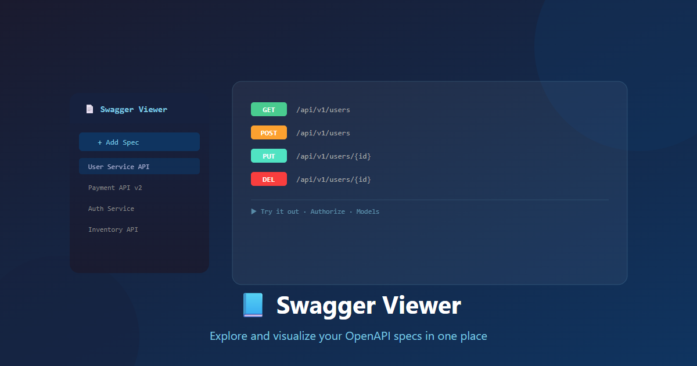

# 📘 Swagger Viewer

> Explore and visualize your OpenAPI specs in one place — no backend, no login, no setup.

[](https://swagview.netlify.app)


**Live → [swagview.netlify.app](https://swagview.netlify.app)**



---

## Features

- **Paste YAML** — drop your OpenAPI YAML directly into the editor
- **Import file** — load a `.yaml` / `.yml` file from your machine
- **Multiple specs** — manage a list of specs from the sidebar, switch instantly
- **Try it out** — interact with endpoints directly inside the viewer
- **Auto saved** — all specs persist in your browser's `localStorage`, nothing sent to any server
- **Zero dependencies** — a single HTML file, works anywhere

## Usage

1. Open [swagview.netlify.app](https://swagview.netlify.app)
2. Click **+ Add Spec** in the sidebar
3. Give your spec a name, then paste YAML or import a `.yaml` file
4. Hit **Save** — your spec appears in the sidebar instantly
5. Click any spec to render it; use **Try it out** to call endpoints live

### Keyboard shortcuts

| Shortcut | Action |
|---|---|
| `Ctrl / ⌘` + `Enter` | Save spec in modal |
| `Escape` | Close modal |

## Self-hosting

It's a single file — just copy `index.html` anywhere:

```bash
# Serve locally
npx serve .

# Or open directly in a browser
open index.html
```

To deploy your own copy on Netlify:

1. Fork this repo
2. Connect it to Netlify (or drag-and-drop `index.html`)
3. Done — no build command, publish directory is `.`

## Tech stack

| Library | Purpose |
|---|---|
| [Swagger UI v5](https://github.com/swagger-api/swagger-ui) | Renders OpenAPI specs |
| [js-yaml 4](https://github.com/nodeca/js-yaml) | Parses YAML input |
| Browser `localStorage` | Persists specs client-side |

## Contributing

1. Fork the repo and make your changes to `index.html`
2. Open a pull request — no build step required

## License

MIT
